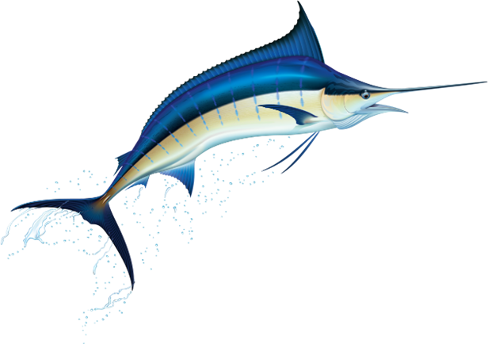

# PyMarlin, a lightweight PyTorch library for agile deep learning!

PyMarlin was developed with the goal of simplifying the E2E Deep Learning experimentation lifecycle both in public and M365 compliant environments. The library enables an agile way to quickly prototype a new AI scenario on dev box and seamlessly scale it training multi-node DDP GPU training with AzureML or other cloud services.

## Key features
- Provides public and enterprise **data pre-processing** recipes, which provides out of the box vanilla and parallel processing. It requires no additional code to run for AML vs non-AML scenarios easily.
- Provides **scalable model training** with support for Single Process, VM, multi-GPU, multi-node, distributed Data Parallel, mixed-precision (AMP, Apex) training. ORT and DeepSpeed based training are going to be available soon!
- (TBA) Provides out of the box **Plugins** that can be used for all typical NLP tasks like Sequence Classification, Named Entity Recognition and Seq2Seq text generation.
- Provides **reusable modules** for model checkpointing, stats collection, Tensorboard and compliant AML logging which can be customized based on your scenario.
- Provides **custom arguments parser** that allows for saving all the default values for arguments related to a scenario in an YAML config file, merging user provided arguments at runtime.

## Installation
    Check out the [installation doc](website/docs/installation.md) for more information.

## Start exploring!

### Train your first model with pymarlin

Check out [CIFAR image classification](website/docs/examples/cifar.md) from the EXAMPLES section.

### GLUE task benchmarking

Explore how to use pymarlin to [benchmark your models on GLUE tasks](website/docs/examples/glue-tasks.md).

## We want your feedback!

Reach out to us with your [feedback and suggestions](website/docs/credits.md).
