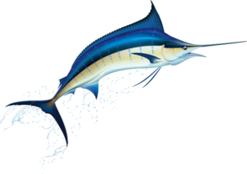

# Getting Started

### Welcome to Marlin, a lightweight PyTorch library for agile deep learning!  

Marlin was developed with the goal of simplifying the E2E Deep Learning experimentation lifecycle both in public and M365 compliant environments. The library enables an agile way to quickly prototype a new AI scenario on dev box and seamlessly scale it to public and compliant AML.  

## Key features

- Provides public and enterprise **data pre-processing** recipes, which provides out of the box vanilla and parallel processing. It requires no additional code to run for AML vs non-AML scenarios easily.
- Provides **scalable model training** with support for Single Process, VM, multi-GPU, multi-node, distributed Data Parallel, mixed-precision (AMP, Apex) training. ORT and DeepSpeed based training are going to be available soon!
- Provides out of the box **Plugins** that can be used for all typical NLP tasks like Sequence Classification, Named Entity Recognition and Seq2Seq text generation.
- Provides **model abstraction** to allow for easy finetuning scenario integration with various Huggingface and Turing models.
- Provides **reusable modules** for model checkpointing, stats collection, Tensorboard and compliant AML logging which can be customized based on your scenario.
- Provides **custom arguments parser** that allows for saving all the default values for arguments related to a scenario in an YAML config file, merging user provided arguments at runtime.
- All core modules are thoroughly **unit tested** and conform to Pylint requirements for **seamless Polymer deployment**.

## Start exploring!

### Train your first model with Marlin

Check out [CIFAR image classification](examples/cifar.md) from the EXAMPLES section.

### Marlin Plugins

Out-of-the box training of Huggingface models on downstream tasks with Marlin Plugins, learn from this [text sequence classification example](plugins/hf_seq_classification.md) and explore our other plugins.

### GLUE task benchmarking

Explore how to use Marlin to [benchmark your models on GLUE tasks](examples/glue-tasks.md).

### Learn about MarlinAutoModels

Leverage [MarlinAutoModels](models/automodels.md) to load models from the Turing family.

## We want your feedback!

Reach out to us with your [feedback and suggestions](credits.md).