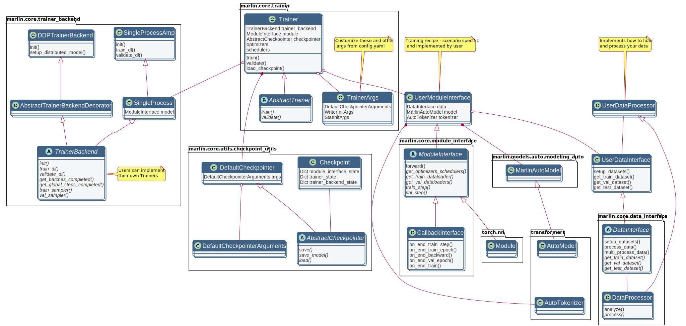
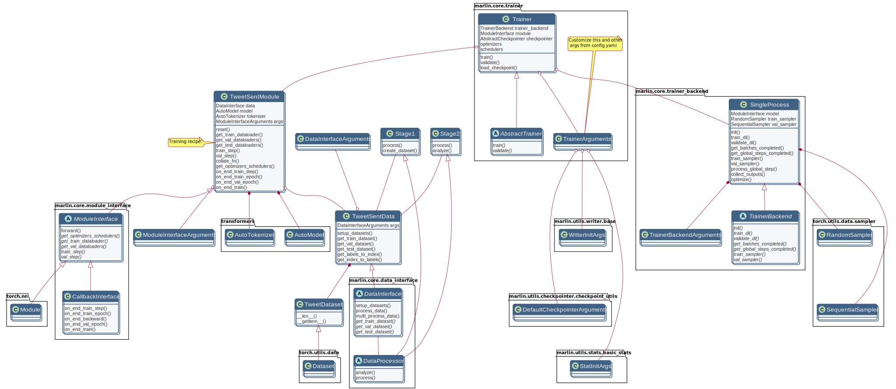
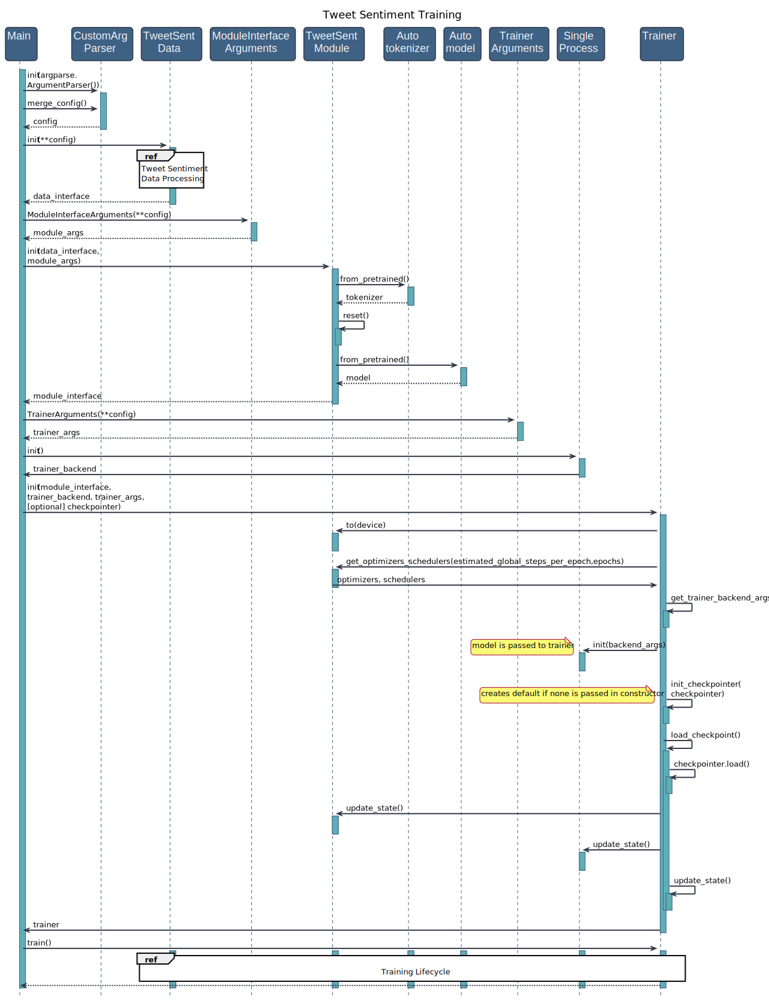
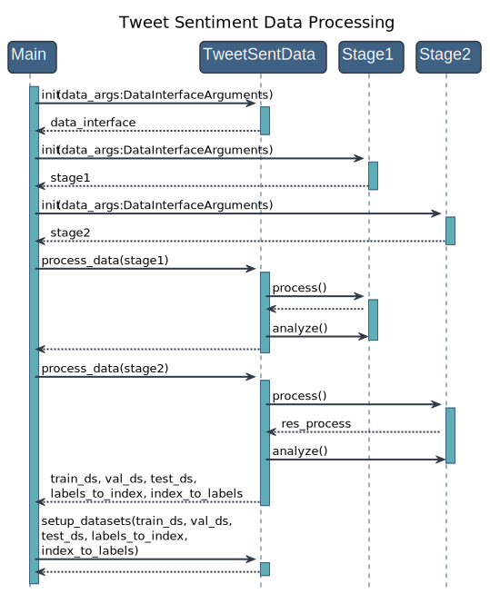
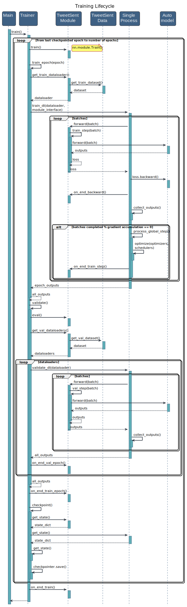

# Marlin in pictures

Marlin is designed to improve agility, scalability, code manageability, all while
providing flexibility and control across DL environments. Due to this, Marlin is divided
into various components correspoinding to extensible classes, only a few of which need to
be implemented by users. As shown in the following class diagram, the key clases that need
to be implemented are **DataInterface** and **ModuleInterface**. These interact with **Trainer** which
acts as an orchestrator, and **TrainerBackend**, which themselves are extensible and configurable via
arguments.

## Classification task example

Below you can find a collection of class and sequence diagrams
for a classification task that exemplifies the use of marlin. The example
shown implements the DataInterface and ModuleInterface for classifying tweet
sentiment, as TweetSentData and TweetSentModule. The class diagram
illustrates which classes correspond to built-in marlin classes, user-extended
classes specific to the scenario, and some important external depenencies used.

### Class Diagram

This diagram shows the classes implemented for the classification task, as well as
relationships between the important marlin modules. Here, ModuleInterface has been
extended as *TweetSentModule*, DataInterface as *TweetSentDataModule*, and
data processing is managed by classes *Stage1* and *Stage2*, extended from DataProcessor. As a TrainerBackend, SingleProcess class is used for this example.
Most customization and settings come from modifying default TrainerArguments
via the config.yaml file.

### Training

The following sequence diagram illustrates how to train the above classification
model, with emphasis on the module instanciation users need to perform as part
of their main script. Details on Data Processing and the Training Lifecycle referenced
in this diagram can be found below.

### Data Processing

Sequence diagram for the data processing prior to training.

### Training Lifecycle

Sequence diagram for the training loop.

