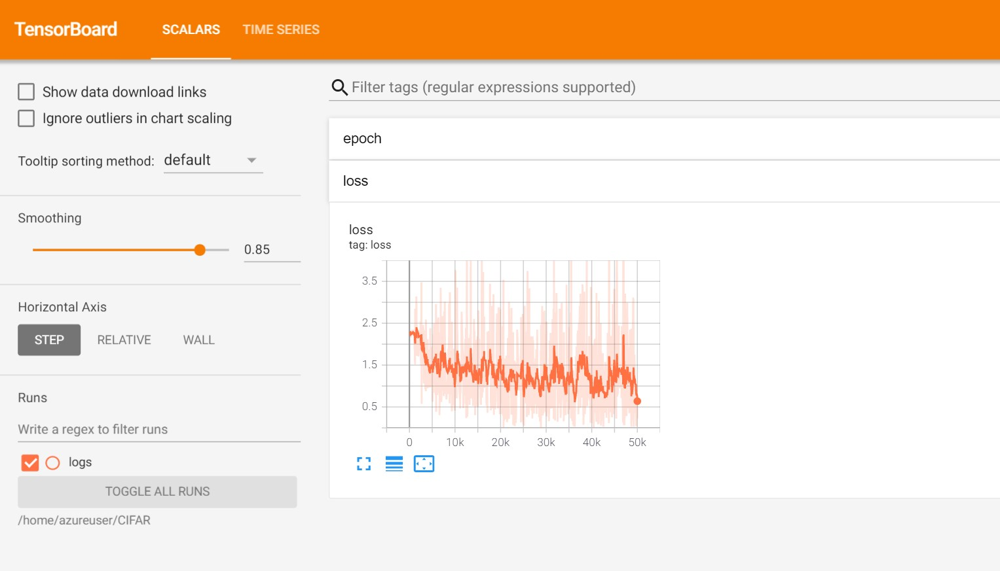

The jupyter notebook is good for just trying out CIFAR using pymarlin.
## Run in [Collab](https://colab.research.google.com/github/microsoft/PyMarlin/blob/krkusuk/examples/examples/CIFAR/CIFAR.ipynb)

To use other advanced features like distributed training, yaml parser, tensorboard etc. use the python file and follow the instructions below.

Note: Recommended to use a machine with more than one GPU to try out all features

# 1. Install Pymarlin ,pytorch, requirements

    Follow steps here https://microsoft.github.io/PyMarlin/docs/installation
    
    pip install -r requirements.txt

# 2. Run CIFAR

## Single process

    python cifar.py --config_path config.yaml

## Mixed Precission (Needs GPU)

    python cifar.py --config_path config.yaml --tr.backend sp-amp

## Multi process (Needs at least 2 GPUs)

    python -m torch.distributed.launch --nproc_per_node 2 cifar.py --config_path config.yaml --tr.backend ddp

# Results

    Val accuracy at step 50000 = 61.14

# Tensorboard

    tensorboard --logdir logs

