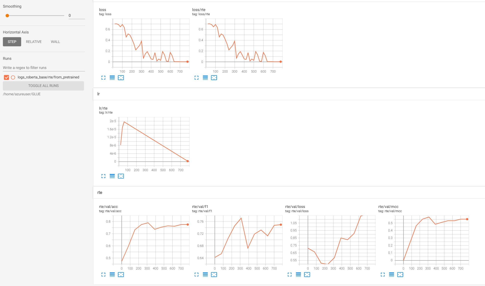

# GLUE Finetuning

Krishan Subudhi

---

This code works well in a virtual machine with GPU (preferably with nvidia V100 or A100 GPU for AMP support). More information can be found in this [blog](https://krishansubudhi.github.io/deeplearning/2020/12/09/run-ml-on-vm.html).

We can train any GLUE task using this code. This blog only shows instruction for RTE. Running other tasks are relatively straight forward.

This code can be used for any other single sentence or sentence pair classifier too. A new DataInterface needs to be created for non-GLUE dataset.

## Move the code to GPU VM (Optional)

    scp -r -P $port .\examples\GLUE\  $user@${machine}:/home/$user
    ssh $user@$machine -p $port

## Setup environment and dependencies

    conda create -n pymarlin
    conda activate pymarlin
    pip install -r requirements.txt
## Analyze data
Script:

    python src/data.py rte

Result: 

    DatasetDict({
        train: Dataset({
            features: ['sentence1', 'sentence2', 'label', 'idx'],
            num_rows: 2490
        })
        validation: Dataset({
            features: ['sentence1', 'sentence2', 'label', 'idx'],
            num_rows: 277
        })
        test: Dataset({
            features: ['sentence1', 'sentence2', 'label', 'idx'],
            num_rows: 3000
        })
    })

    train data label distribution
        idx  label                                          sentence1                                          sentence2
    0    0      1  No Weapons of Mass Destruction Found in Iraq Yet.         Weapons of Mass Destruction Found in Iraq.
    1    1      0  A place of sorrow, after Pope John Paul II die...  Pope Benedict XVI is the new leader of the Rom...
        count     ratio
    label                 
    0       1249  0.501606
    1       1241  0.498394
    count    2490.000000
    mean       43.565462
    std        32.389776
    min         4.000000
    50%        31.000000
    95%       112.000000
    99%       143.000000
    99.9%     170.066000
    max       239.000000
    Name: sentence1, dtype: float64
    count    2490.000000
    mean        8.790361
    std         4.396781
    min         3.000000
    50%         8.000000
    95%        18.000000
    99%        26.000000
    99.9%      31.000000
    max        41.000000
    Name: sentence2, dtype: float64

    validation data label distribution
    idx  label                                          sentence1                                         sentence2
    0    0      1  Dana Reeve, the widow of the actor Christopher...                Christopher Reeve had an accident.
    1    1      0  Yet, we now are discovering that antibiotics a...  Bacteria is winning the war against antibiotics.
        count     ratio
    label                 
    0        146  0.527076
    1        131  0.472924

## Train and validate
Script Single GPU:

    python src/train.py --config_path configs-roberta-base/rte.yaml

Script multiple GPUs:

    python -m torch.distributed.launch --nproc_per_node 4 src/train.py --config_path configs-roberta-base/rte.yaml --distributed

Results:

    tensorboard --logdir logs_roberta_base

Tunnel to view tensorboard UI: (if using VM):

    ssh -N -f -L 127.0.0.1:6006:127.0.0.1:6006  $user@${machine} -p $port

View Tensorboard UI:

    http://localhost:6006/

## infer
0 is entailment, 1 is contradiction.

Script

    python src/infer.py  --config_path configs-roberta-base/rte.yaml 

Input

    sentence1 = ['No Weapons of Mass Destruction Found in Iraq Yet.',
                'India is a hot country',
                'Krishan has written this inference example']
    sentence2 = ['Weapons of Mass Destruction Found in Iraq.',
                'It\'s warm in india',
                'Krishan is the author of this example']

Result:

    tensor([1, 0, 0])