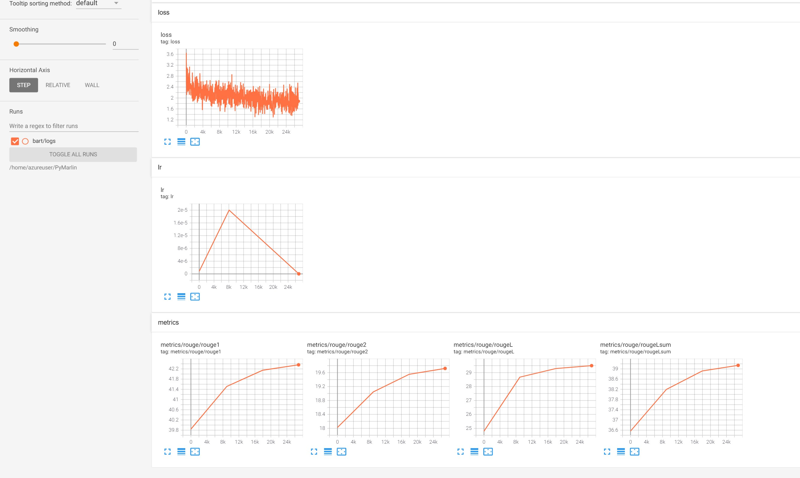

# Bart Summarization

Krishan Subudhi

---

This is an example explaining entire pipe line for a summarization task using pymarlin library.

Dataset used: CNN Daily mail

Model : [BART](https://arxiv.org/abs/1910.13461)

We start with a pretrained checkpoint from huggingface and finetune on CNN dailymail data. 

Huggingface Bart model documantation: https://huggingface.co/transformers/model_doc/bart.html

# Local Machine
## 1. Download Data

    wget https://cdn-datasets.huggingface.co/summarization/cnn_dm_v2.tgz -UseBasicParsing

    dir 'C:/Users/krkusuk/Downloads/'

    tar -xzvf 'C:/Users/krkusuk/Downloads/cnn_dm_v2.tgz'  # empty lines removed

    mv 'cnn_cln' 'D:/data'

    dir 'D:/data/cnn_cln'

## 2. Preprocess and analyze

    python data.py 'D:/data/cnn_cln'

## 3. Train

    python train.py --data_path D:/data/cnn_cln

# GPU VM

Boot a DSVM in azure with V100 GPUs. Enable ssh access by entering your public SSH key during booting. 
Create these environment variables in your local machine for easy login.

* $user : username of the VM
* $machine : machine IP
* $port : SSH port

## 1. Setup VM environment

    ssh $user@$machine -p $port
    bash
    wget https://repo.anaconda.com/miniconda/Miniconda3-latest-Linux-x86_64.sh
    bash Miniconda3-latest-Linux-x86_64.sh -y

restart shell

    nvidia-smi
    conda create -n pymarlin python=3.8 -y
    conda activate pymarlin
    conda install pytorch cudatoolkit=10.2 -c pytorch -y # make sure cuda version is same as nvidia-smi
    mkdir PyMarlin

## 2. Transfer code form local machine to VM
    scp -P $port -r C:\Users\krkusuk\repos\PyMarlin\pymarlin $user@${machine}:/home/$user/PyMarlin/pymarlin
    scp -P $port -r C:\Users\krkusuk\repos\PyMarlin\setup.py  $user@${machine}:/home/$user/PyMarlin
    scp -P $port -r C:\Users\krkusuk\repos\PyMarlin\README.md  $user@${machine}:/home/$user/PyMarlin
    scp -P $port -r C:\Users\krkusuk\repos\PyMarlin\examples\bart $user@${machine}:/home/$user\PyMarlin\bart 

## 3. Install pymarlin and requirements
    > ssh $user@$machine -p $port
    $ conda activate pymarlin
    $ pip install  ./PyMarlin --force-reinstall

    or

    $ export PYTHONPATH=~/PyMarlin/

## 4. Downlaod data
    $ wget https://cdn-datasets.huggingface.co/summarization/cnn_dm_v2.tgz
    tar -xzvf cnn_dm_v2.tgz
    cd PyMarlin/bart

## 5. Analyze Data
        python data.py  ~/cnn_cln
        
        **** Analyzing Train ***
                                              source
                target
        0  Editor's note: In our Behind the Scenes series...  Mentally ill inmates in Miami are housed on th...
        1  LONDON, England (Reuters) -- Harry Potter star...  Harry Potter star Daniel Radcliffe gets £20M f...
        2  MINNEAPOLIS, Minnesota (CNN) -- Drivers who we...  NEW: "I thought I was going to die," driver sa...
        3  BAGHDAD, Iraq (CNN) -- Dressed in a Superman s...  Parents beam with pride, can't stop from smili...
        4  WASHINGTON (CNN) -- Doctors removed five small...  Five small polyps found during procedure; "non...

        Word length analysis:
                    source         target
        count  287112.000000  287112.000000
        mean      691.873032      51.573752
        std       336.498413      21.255547
        min        18.000000       4.000000
        25%       443.000000      38.000000
        50%       632.000000      48.000000
        75%       877.000000      60.000000
        max      2347.000000    1296.000000

        **** Analyzing Val ***
                                                    source
                        target
        0  (CNN)The only thing crazier than a guy in snow...  A man in suburban Boston is selling snow onlin...
        1  (CNN)On the 6th of April 1996, San Jose Clash ...  The 20th MLS season begins this weekend . Leag...
        2  (CNN)French striker Bafetimbi Gomis, who has a...  Bafetimbi Gomis collapses within 10 minutes of...
        3  (CNN)My vote for Father of the Year goes to Cu...  Ruben Navarrette: Schilling deserves praise fo...
        4  (CNN)It was an act of frustration perhaps more...  Rory McIlroy throws club into water at WGC Cad...

        Word length analysis:
                    source        target
        count  13368.000000  13368.000000
        mean     676.026406     57.910084
        std      343.557667     25.613557
        min       41.000000     10.000000
        25%      413.750000     41.000000
        50%      608.000000     54.000000
        75%      868.000000     69.000000
        max     1917.000000   1440.000000

## 6. Train

The 75 percentile length for source text is 877 and 60 for target text. The sequence length after tokenization will also increase further. BART was pretrained with positional embedding upto 1024. We will use 1024 length for source and 128 for target. This value can be tuned further for better performance.

`config.yaml` contains code which runs only for few steps to check if everything is OK. Run it to verify the correctness of the code and test the environment setup. This can also be run with CPU to do sanity test before moving code to GPU or running in AML.

### Train for few more steps
    $ python data.py ~/cnn_cln # skip if ran previously
    $ python train.py --data_path ~/cnn_cln

    
    $ python train.py --data_path ~/cnn_cln --tmgr.max_train_steps_per_epoch 20 --tmgr.max_val_steps_per_epoch 20 --tmgr.epochs 3

### Run production config

#### Full training on single GPU
    python train.py --config_path config-prod.yaml --data_path ~/cnn_cln --dist False

This will be really slow though. Use PyMarlin's distributed trainer to speed up training

## 7. Distributed Training
Test config

    python -m torch.distributed.launch --nproc_per_node 4 train.py --data_path ~/cnn_cln --dist

Prod config

    nohup python -m torch.distributed.launch --nproc_per_node 4 train.py --config_path config-prod.yaml --data_path ~/cnn_cln --dist &> prod-logs-dist.txt

    tail -f  prod-logs-dist.txt

*Command to Kill all processes*

    ps |grep python | awk '{print $1}' | xargs -I% kill -9 %

## 8. Start tensorboard in VM
In a separate shell,

    $ tensorboard --logdir ~/PyMarlin/bart/logs.

Tunnel tensorboard in local machine
    # ssh -N -f -L 127.0.0.1:6006:127.0.0.1:6006  $user@${machine} -p $port

Now open tensorboard: http://localhost:6006/#scalars

## 9. Optimize with ORT+DeepSpeed and run in AzureML
Go to [the ORT README](ORT_README.md) for more instructions.