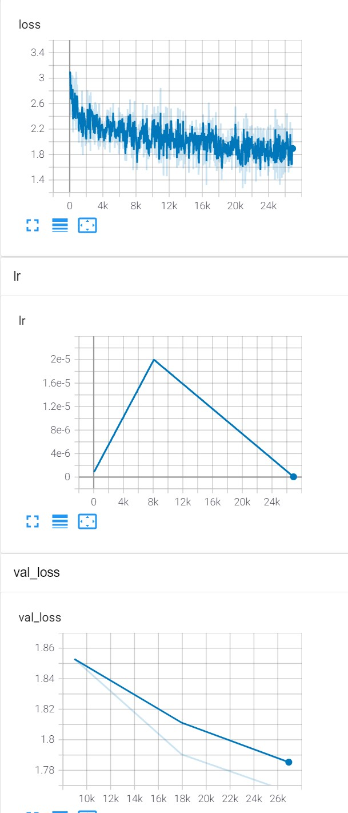

# BART Summarization

This is an example explaining entire pipe line for a summarization task using pymarlin library.

[Source code location](https://github.com/microsoft/PyMarlin/tree/main/examples/bart).

Dataset used: CNN Daily mail
Model : [BART] (https://arxiv.org/abs/1910.13461)

We start with a pretrained checkpoint from huggingface and finetune on CNN dailymail data. 

Huggingface Bart model documantation: https://huggingface.co/transformers/model_doc/bart.html
## Download Data

    wget https://cdn-datasets.huggingface.co/summarization/cnn_dm_v2.tgz -UseBasicParsing

    dir 'C:/Users/krkusuk/Downloads/'

    tar -xzvf 'C:/Users/krkusuk/Downloads/cnn_dm_v2.tgz'  # empty lines removed

    mv 'cnn_cln' 'D:/data'

    dir 'D:/data/cnn_cln'

## Preprocess and analyze

    python data.py 'D:/data/cnn_cln'

## Train

    python train.py --data_path D:/data/cnn_cln

## Train on VM

In powershell: (Run this for every cell you create)

    $machine='104.210.193.245'
    $user='elr'
    $port='22'

    #V100
    https://ml.azure.com/compute/login-krishan/details/nodes?wsid=/subscriptions/42ae47bd-b19b-42c1-b0b9-19fd5be9d51b/resourcegroups/bert-base/workspaces/SubstrateIntelligenceNLR-WS3&tid=72f988bf-86f1-41af-91ab-2d7cd011db47

    $machine='13.85.199.246';$user='azureuser';$port='50000'
    
### Environment setup
    ssh $user@$machine -p $port
    bash

    wget https://repo.anaconda.com/miniconda/Miniconda3-latest-Linux-x86_64.sh
    bash Miniconda3-latest-Linux-x86_64.sh -y

restart shell

    nvidia-smi
    conda create -n pymarlin python=3.8 -y
    conda activate pymarlin
    conda install pytorch cudatoolkit=10.2 -c pytorch -y # make sure cuda version is same as nvidia-smi

### Downlaod data
    wget https://cdn-datasets.huggingface.co/summarization/cnn_dm_v2.tgz
    tar -xzvf cnn_dm_v2.tgz

    Analyze:
        pymarlin_Scenarios\bart> python data.py  D:/data/cnn_cln
        Train
                                                    source                                             target
        0  Editor's note: In our Behind the Scenes series...  Mentally ill inmates in Miami are housed on th...
        1  LONDON, England (Reuters) -- Harry Potter star...  Harry Potter star Daniel Radcliffe gets £20M f...
        2  MINNEAPOLIS, Minnesota (CNN) -- Drivers who we...  NEW: "I thought I was going to die," driver sa...
        3  BAGHDAD, Iraq (CNN) -- Dressed in a Superman s...  Parents beam with pride, can't stop from smili...
        4  WASHINGTON (CNN) -- Doctors removed five small...  Five small polyps found during procedure; "non...
        Word length analysis:
                    source         target
        count  287112.000000  287112.000000
        mean      691.873032      51.573752
        std       336.498413      21.255547
        min        18.000000       4.000000
        25%       443.000000      38.000000
        50%       632.000000      48.000000
        75%       877.000000      60.000000
        max      2347.000000    1296.000000
        Val
                                                    source                                             target
        0  (CNN)The only thing crazier than a guy in snow...  A man in suburban Boston is selling snow onlin...
        1  (CNN)On the 6th of April 1996, San Jose Clash ...  The 20th MLS season begins this weekend . Leag...
        2  (CNN)French striker Bafetimbi Gomis, who has a...  Bafetimbi Gomis collapses within 10 minutes of...
        3  (CNN)My vote for Father of the Year goes to Cu...  Ruben Navarrette: Schilling deserves praise fo...
        4  (CNN)It was an act of frustration perhaps more...  Rory McIlroy throws club into water at WGC Cad...
        Word length analysis:
                    source        target
        count  13368.000000  13368.000000
        mean     676.026406     57.910084
        std      343.557667     25.613557
        min       41.000000     10.000000
        25%      413.750000     41.000000
        50%      608.000000     54.000000
        75%      868.000000     69.000000
        max     1917.000000   1440.000000
### Transferring code
    scp -P $port -r C:\Users\krkusuk\repos\ELR\sources\dev\SubstrateInferences\pymarlin $user@${machine}:/home/$user 
    scp -P $port -r C:\Users\krkusuk\repos\ELR\sources\dev\SubstrateInferences\pymarlin_Scenarios\bart $user@${machine}:/home/$user 

### Install pymarlin and requirements
    > ssh $user@$machine -p $port
    $ pip install  ./pymarlin --force-reinstall
    $ pip install -r pymarlin/requirements.txt
    $ cd bart
### Run code 
    $ python data.py ../cnn_cln # run only once
    $ python train.py --data_path ../cnn_cln
    $ python train.py --data_path ../cnn_cln --tmgr.max_train_steps_per_epoch 20 --tmgr.max_val_steps_per_epoch 20 --tmgr.epochs 3

### Run production config
Test first
    $ python train.py --config_path config-prod.yaml --data_path ../cnn_cln --tmgr.max_train_steps_per_epoch 20 --tmgr.max_val_steps_per_epoch 20 --tmgr.epochs 2 
### Full training on single GPU
    nohup python train.py --config_path config-prod.yaml --data_path ../cnn_cln &> prod-logs.txt & 
    [2] 5455
    tail -f prod-logs.txt

### Full training on all GPUs
    nohup python -m torch.distributed.launch --nproc_per_node 4 train.py --config_path config-prod.yaml --data_path ../cnn_cln --dist &> prod-logs-dist.txt & 
    tail -f  prod-logs-dist.txt

#### Kill all processes
    ps |grep python | awk '{print $1}' | xargs -I% kill -9 %

### Start tensorboard in VM
    $ tensorboard --logdir .
#### Tunnel tensorboard in local machine
    # ssh -N -f -L 127.0.0.1:6006:127.0.0.1:6006  $user@${machine} -p $port

Now open tensorboard: http://localhost:6006/#scalars

## Training curves

### Evaluation metrices
Paper Result:
    R1 R2 RL
    44.16 21.28 40.90

Before training (1000 val steps)
    python train.py --config_path config-prod.yaml --data_path ../cnn_cln --dist False --tmgr.disable_tqdm False --gpu_batch_size_limit 32 [--tmgr.max_val_steps_per_epoch 1000]
    metrics/rouge : {'rouge1': 21.443, 'rouge2': 7.9516, 'rougeL': 16.5086, 'rougeLsum': 19.4402}

After Training:
    python train.py --config_path config-prod.yaml --data_path ../cnn_cln --dist False --tmgr.disable_tqdm False --gpu_batch_size_limit 32 --tmgr.max_val_steps_per_epoch 1000 --chkp.load_dir ../ --chkp.load_filename trained_model.tar -- cuda 2
    {'rouge1': 26.4461, 'rouge2': 12.6203, 'rougeL': 21.6998, 'rougeLsum': 24.682}

Samples:

True summaries:

['A man in suburban Boston is selling snow online to customers in warmer states . For $89, he will ship 6 pounds of snow in an insulated Styrofoam box .', 
'The 20th MLS season begins this weekend . League has changed dramatically since its inception in 1996 . Some question whether rules regarding salary caps and transfers need to change .', 
'Bafetimbi Gomis collapses within 10 minutes of kickoff at Tottenham . But he reportedly left the pitch conscious and wearing an oxygen mask . Gomis later said that he was "feeling well" The incident came three years after Fabrice Muamba collapsed at White Hart Lane .', 
'Ruben Navarrette: Schilling deserves praise for taking on online haters for offensive comments about his daughter . Navarrette: In protecting his child, Schilling set a model for parenting and taught us a lesson about social media .', 
'Rory McIlroy throws club into water at WGC Cadillac Championship . Northern Irishman frustrated after pulling shot into water hazard .']

Predicted Summaries:
['Self-styled entrepreneur Kyle Waring is selling snow in insulated Styrofoam', 
'The MLS is set to mark the beginning of its 20th season . Attendances have', 
"French striker Bafetimbi Gomis collapses during Swansea's 3-2", 
'Gabby Schilling, 17, was harassed by a group of Twitter trolls . Sch', 
'Rory McIlroy pulls his second shot on the eighth hole of the WGC']

Clearly the target summaries are longer than the predictions, but the summaries are of very high quality. With some parameter changes to decoding beam search, ROUGE scores can be improved. 

Now let's add these params to our config file and pass them to the generate function of BART.
    generate:
        max_length: 128
        do_sample : False
        num_beams : 5

    python train.py --config_path config-prod.yaml --data_path ../cnn_cln --dist False --tmgr.disable_tqdm False --gpu_batch_size_limit 32 --tmgr.max_val_steps_per_epoch 100 --chkp.load_dir ../ --chkp.load_filename trained_model.tar -- cuda 2

    metrics/rouge : {'rouge1': 33.1999, 'rouge2': 13.6649, 'rougeL': 24.1031, 'rougeLsum': 30.2454}

    ['A man in suburban Boston is selling snow online to customers in warmer states . For $89, he will ship 6 pounds of snow in an insulated Styrofoam box .', 'The 20th MLS season begins this weekend . League has changed dramatically since its inception in 1996 . Some question whether rules regarding salary caps and transfers need to change .', 'Bafetimbi Gomis collapses within 10 minutes of kickoff at Tottenham . But he reportedly left the pitch conscious and wearing an oxygen mask . Gomis later said that he was "feeling well" The incident came three years after Fabrice Muamba collapsed at White Hart Lane .', 'Ruben Navarrette: Schilling deserves praise for taking on online haters for offensive comments about his daughter . Navarrette: In protecting his child, Schilling set a model for parenting and taught us a lesson about social media .', 'Rory McIlroy throws club into water at WGC Cadillac Championship . Northern Irishman frustrated after pulling shot into water hazard .']
    ['Self-styled entrepreneur Kyle Waring will ship 6 pounds of Boston-area snow in an insulated Styrofoam box . "We will not ship snow to any states in the northeast!" says Waring\'s website, ShipSnowYo.com . His website and social media accounts claim to have filled more than 133 orders for snow .', 'The MLS is set to mark the beginning of its 20th season . Attendances are higher than ever before while the number of teams involved has doubled . The new season is the first of a new domestic TV and media rights deal with FOX, ESPN and Univision worth $700 million over eight years .', 'French striker Bafetimbi Gomis collapses during Swansea\'s 3-2 loss at Tottenham . The 29-year-old left the pitch conscious following about five minutes of treatment . Swansea manager Garry Monk says he is now "feeling well"', "Curt Schilling is the father of the year for his daughter Gabby Schilling . Schilling's daughter, 17, was sent a tweet congratulating her on being accepted to Salve Regina University . The tweets quickly went from immature, to creepy, to repugnant, Schilling says . He says social media sites like Twitter, Facebook, Instagram and others allow sharing of information .", 'Rory McIlroy pulls his second shot on the eighth hole of the WGC Cadillac Championship into a lake . The four-time major winner launched the 3-iron used to play the offending shot into the water . The Northern Irishman composed himself to finish with a second round of 70, leaving him one-under for the tournament .']

The intuition works! The results are closer to paper results. Leaving it to the users to tune further hyper parameters.
        
## Infer
    python infer.py --model_path checkpoints --model_file model_2.tar

    Home Secretary Priti Patel warns people trying to leave UK will be turned back at airports and lashes influencers 'working' in the sun as she unveils quarantine rules for Brits returning from 30 high-risk countries
    
    Summary: </s><s>Home Secretary Priti Patel unveils quarantine rules for Brits returning from 30 high</s>

