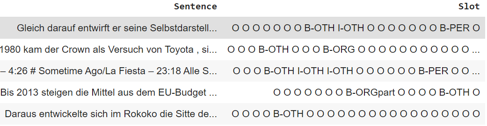

# Named Entity Recognition with HuggingFace models

We designed this plugin to allow for out-of-the-box training and evaluation of HuggingFace models for NER tasks. We provide a golden config file (config.yaml) which you can adapt to your task. This config will make experimentations easier to schedule and track. All the source code and notebooks to submit jobs can be found [here](https://o365exchange.visualstudio.com/O365%20Core/_git/ELR?path=%2Fsources%2Fdev%2FSubstrateInferences%2FMarlin_Scenarios%2Fner%2Ftest_nerPlugin)

## Step by step with GermEval dataset

We will go through how to adapt any dataset/task for PyMarlin and how to setup the plugin. For this purpose we will use the GermEval dataset - this is a dataset with German Named Entity annotation , with data sampled from German Wikipedia and News Corpora. For more granular information and raw dataset please refer [here](https://sites.google.com/site/germeval2014ner/data)

Following HuggingFace documentation for preliminary data clean up we use their preprocess script to clean up the original dataset. These can be run in jupyter Notebook.

```python
!wget "https://raw.githubusercontent.com/stefan-it/fine-tuned-berts-seq/master/scripts/preprocess.py"
!grep -v "^#" NER-de-train.tsv| cut -f 2,3 | tr '\t' ' ' > train.txt.tmp
!grep -v "^#" NER-de-dev.tsv| cut -f 2,3 | tr '\t' ' ' > dev.txt.tmp
!python preprocess.py train.txt.tmp 'bert-base-multilingual-cased' '128' > train.txt
!python preprocess.py dev.txt.tmp 'bert-base-multilingual-cased' '128' > dev.txt
!cat train.txt dev.txt | cut -d " " -f 2 | grep -v "^$"| sort | uniq > labels.txt
```

## Dataset format

NER plugin expects the input to be a TSV or CSV with 2 columns. A column with the text sentences followed by a column with the labels for the tokens in the sentence. For example: 'Sentence': 'who is harry', 'Slot': 'O O B-contact_name'

For GermEval dataset below we show how to modify to format expected by plugin.

```python
import csv
def txt2tsv(filename, outfile):
  outfile = open(outfile, "w")
  f = open(filename, "r")
  lines = f.readlines()
  sentence = []
  labels = []
  tsv_writer = csv.writer(outfile, delimiter='\t')
  tsv_writer.writerow(['Sentence', 'Slot'])
  for line in lines:
    line = line.strip()
    if line:
      row = line.split(' ')
      sentence.append(row[0])
      labels.append(row[1])
    else:
      sent = ' '.join(sentence)
      lab = ' '.join(labels)
      tsv_writer.writerow([sent, lab])
      sentence = []
      labels = []

txt2tsv("dev.txt", "dev.tsv")
txt2tsv("train.txt", "train.tsv")
```

The dataset would now look like this:




## Golden yaml config

Marlin leverages yaml files for maintaining experiment parameters. For this German Evaluation dataset we provide a golden config `config_germ.yaml`. 

```python
# data_processor args
data:
    train_dir : null
    val_dir : null
    labels_list: [B-LOC, B-LOCderiv, B-LOCpart, B-ORG, B-ORGderiv, B-ORGpart, B-OTH, B-OTHderiv,
        B-OTHpart, B-PER, B-PERderiv, B-PERpart, I-LOC, I-LOCderiv, I-LOCpart, I-ORG, I-ORGderiv,
        I-ORGpart, I-OTH, I-OTHderiv, I-OTHpart, I-PER, I-PERderiv, I-PERpart, O]  
    tokenizer: "bert-base-multilingual-cased"
    file_format: "tsv"
    has_labels: True

# model arguments
model:
    model_name: "bert"
    encoder_key: "bert"
    hf_model: "bert-base-multilingual-cased"
    model_file: "pytorch_model.bin"
    model_config_file: "config.json"
    model_path: null
    model_config_path: null

# module_interface arguments
module:
    output_dir: null
    max_lr : 0.00003 # Maximum learning rate.
    warmup_prop: 0.1
    max_seq_len: 128
    pad_label_id: -100
    has_labels: True

# trainer arguments
trainer:
    backend: "sp"
    train_batch_size: 32 # Training global batch size.
    val_batch_size: 16 # Validation global batch size.
    epochs: 25 # Total epochs to run.
    gpu_batch_size_limit : 8 # Max limit for GPU batch size during training.
    clip_grads : True # Enable or disable clipping of gradients.
    use_gpu: True # Enable or disable use of GPU.
    max_grad_norm: 1.0 # Maximum value for gradient norm.
    writers: ['stdout', 'aml', 'tensorboard'] # List of all the writers to use.
    disable_tqdm: True
    log_level: "DEBUG"
```

## Training

Next we need a orchestrating script to initialize the plugin and start training. Assume the script test.py. It will contain the following.

```python
from pymarlin.plugins import HfNERPlugin
plugin = HfNERPlugin()
plugin.setup_trainer()
trainer = plugin.trainer
trainer.train()
trainer.validate()
```

We can now schedule a run locally using CLI , modify to point to the train and validation directory appropriately :

```python
python test.py --data.train_filepath ./train_germ/train.tsv --data.val_filepath ./val_germ/dev.tsv --config_path config_germ.yaml
```

## Evaluation

We specify the path to store the model checkpoints in our config.yaml

```
# Checkpointer arguments
ckpt:
    checkpoint: True # Flag indicating whether to checkpoint model.
    delete_existing_checkpoints: True
    period: 1 # Period of epochs at which to checkpoint model.
    save_dir: 'ckpts' # Path to directory where MARLIN checkpoints are to be stored.
    model_save_dir: 'model_ckpts' # Path to directory where MODEL checkpoints are to be stored
    file_prefix: 'marlin' # Prefix of the checkpoint filename.
    file_ext: 'bin' # File extension for the checkpoint.
```

The checkpoint consists of all the different components of your scenario like 'module_interface_state', 'trainer_state' and 'trainer_backend_state'. We need to save the model from within the 'module_interface_state' separately. Follow the below steps included in the notebook 'GermEvalAML.ipynb' [here](https://o365exchange.visualstudio.com/O365%20Core/_git/ELR?path=%2Fsources%2Fdev%2FSubstrateInferences%2FMarlin_Scenarios%2Fner%2Fnotebooks%2FGermEvalAML.ipynb)

```
import torch
from collections import OrderedDict
state_dict = torch.load('marlin_0.bin', map_location='cpu')

new_dict = OrderedDict((key.replace('model.',''), value) for key, value in state_dict['module_interface_state'].items() if key.startswith('model.') )
torch.save(new_dict, 'marlin_model.bin')
```

Alternatively you could directly load only the model checkpoint as stored in the path specified by `model_save_dir`. In this case you would have the model weights directly in state_dict without needing to go through module_interface_state

```
import torch
from collections import OrderedDict
state_dict = torch.load('marlin_0.bin', map_location='cpu')

new_dict = OrderedDict((key.replace('model.',''), value) for key, value in state_dict.items() if key.startswith('model.') )  
torch.save(new_dict, 'marlin_model.bin')
```


Now you can use the model file stored as marlin_model.bin. You can specify this new model as the checkpoint to start from in config.yaml

```
# model arguments
model:
    model_name: "bert"
    encoder_key: "bert"
    hf_model: "bert-base-multilingual-cased"
    model_file: "pytorch_model.bin"
    model_config_file: "config.json"
    model_path: "<directory containing ckpt>
    model_config_path: "marlin_model.bin"
```

You can use NER Plugin to evaluate:

```
from marlin.plugins import HfNERPlugin

plugin = HfNERPlugin()
plugin.setup_trainer()
trainer = plugin.trainer
trainer.train()
trainer.validate()
```
