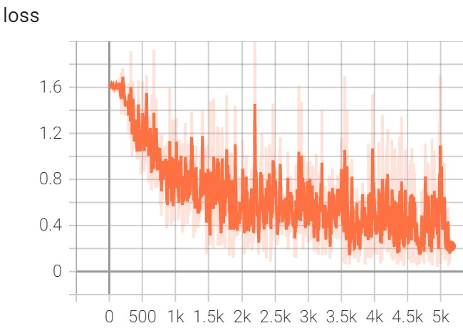
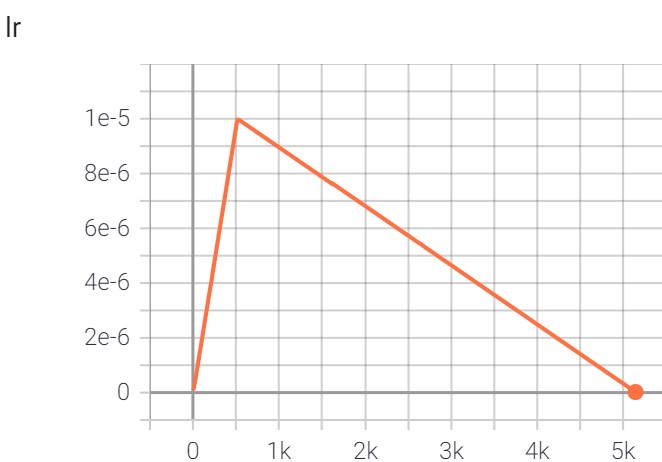
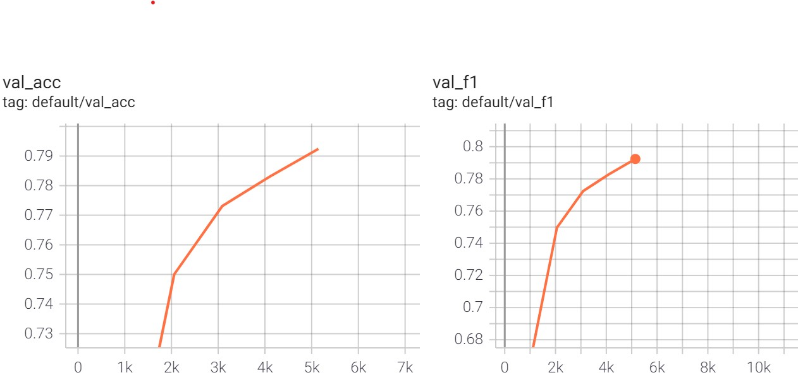

# Text Sequence Classification with Huggingface models

You can use `pymarlin.plugins.hf_seq_classification` for out-of-the-box training of Huggingface models on a downstream sequence classification task. The plugin comes with a golden config file (YAML based). Simply modify a few arguments for your dataset and you're ready to go.

## Walk-thru with a Kaggle dataset

Let us walk through a sample task to better understand the usage. Download the [dataset](https://www.kaggle.com/datatattle/covid-19-nlp-text-classification?select=Corona_NLP_train.csv) for the Coronavirus tweets NLP - Text Classification Kaggle challenge.
```python
    root   
    |-- raw_data
        |-- Corona_NLP_train.csv
        |-- Corona_NLP_test.csv
```

The plugin uses pandas to read the file into a dataframe, however the expected encoding is utf-8. This dataset has a different encoding so we will need to do some preprocessing and create a train-val split.

```python
import pandas as pd
from sklearn.model_selection import train_test_split

df = pd.read_csv("raw_data/Corona_NLP_train.csv", sep=",", encoding='latin-1', header=0)
df = df[["OriginalTweet", "Sentiment"]]
train_df, val_df = train_test_split(df, test_size=0.2)
train_df.to_csv("processed/train.csv", sep=",", index=False)
val_df.to_csv("processed/val.csv", sep=",", index=False)
test_df = pd.read_csv("raw_data/Corona_NLP_test.csv", sep=",", encoding='latin-1', header=0)
test_df = test_df[["OriginalTweet", "Sentiment"]]
test_df.to_csv("processed/test.csv", sep=",", index=False)
```
    root
    |-- raw_data
    |   |-- Corona_NLP_train.csv
    |   |-- Corona_NLP_test.csv
    |
    |-- processed
        |-- train.csv
        |-- val.csv
        |-- test.csv


### Set up the YAML config file

The dataset contains 2 columns OriginalTweet, Sentiment. The goal is to predict the sentiment of the tweet i.e. text classification with a single sequence. We will try out Huggingface's RoBERTa model for this. For the sake of this tutorial, we will directly use OriginalTweet as the text sequence input to the model with no additional data processing steps.

Copy the `config.yaml` file from [here](../../pymarlin/plugins/hf_seq_classification/config.yaml) to your working directory. You can choose to either edit the config file directly, or override the arguments from commandline. Below is the list of arguments that you need to modify for this dataset.
```python
# data related args
data:
    train_filepath: "./processed/train.tsv" # full path to train file
    val_dir: "./processed/val.tsv" # full path to val file
    file_format: "csv"
    header: 0 # file has a header at row 0
    text_a_col: "OriginalTweet"
    text_b_col: null # null in config file is equivalent to None
    label_col: "Sentiment"
    labels_list: ["Extremely Negative","Negative","Neutral","Positive","Extremely Positive"] # list of labels which will be mapped in order from 0 to 4 for the model

# model related args
model:
    hf_model: "roberta-base" # Huggingface model name
    encoder_key: "roberta" # model key which contains the state dict for RobertaModel

# pymarlin module args
module:
    metric: "acc_and_f1"
    max_lr: 0.00001

# trainer args
trainer:
    backend: "sp" # options: sp, sp-amp, ddp, ddp-amp
    # when running on AML compute, change to ddp or ddp-amp (for mixed precision)
    epochs: 3
```

You can also override the default values in the config through CLI. For example:
```
    $ python run.py --data.train_filepath "./processed/train.tsv" --data.val_filepath "./processed/val.tsv" --module.max_lr 0.00005
```

### Training

Create a python script (say run.py) with the following lines of code. Alternatively, you can run it through Python interpreter.

```python
from pymarlin.plugins import HfSeqClassificationPlugin

plugin = HfSeqClassificationPlugin()
plugin.setup()
plugin.trainer.train()
```

This experiment may be too slow to run on local machine (without gpu). You can switch between trainer backends: sp (singleprocess), sp-amp, ddp, ddp-amp (ddp with mixed precision).

Command to run using DistributedDataParallel:
```
    $ python -m torch.distributed.run --nproc_per_node $GPUS_PER_NODE run.py --config_path='./config.yaml' --trainer.backend "ddp"
```

A `logs` folder should have been created which contains tensorboard log.
```
    $ tensorboard --logdir="logs"
```







### Evaluate the finetuned model on the test set

The `config.yaml` file has a section `ckpt` which contains all checkpointer related arguments. The path specified in `model_state_save_dir` should contain your Pytorch model checkpoints. 

```python
# Checkpointer arguments
ckpt:
    checkpoint: True # Flag indicating whether to checkpoint model.
    period: 1 # Period of epochs at which to checkpoint model.
    model_state_save_dir: 'model_ckpts'
    file_prefix: 'pymarlin' # Prefix of the checkpoint filename.
    file_ext: 'bin' # File extension for the checkpoint.
```

The model state dict will contain the prefix `model` to all the keys of the Huggingface model state dict. This is because the `HfSeqClassificationModuleInterface` holds the Huggingface model in the variable `model` and the pymarlin module_interface itself is a torch.nn.Module.

First we will modify the state dict to remove the extra `model` prefix so it can be re-loaded into Huggingface Roberta.
```python
import torch
from collections import OrderedDict
state_dict = torch.load('model_ckpts/pymarlin_model_5.bin', map_location='cpu')
new_dict = OrderedDict((key.replace('model.',''), value) for key, value in state_dict.items() if key.startswith('model.') )
torch.save(new_dict, 'model_ckpts/pymarlin_model_4.bin')
```

Next, we need to edit the `config.yaml` file to point to this model file and the test dataset.
```python
# data related args
data:
    train_filepath: null # null in YAML config is equivalent to None
    val_filepath: "./processed/test.tsv" # provide path to test dataset

# model related args
model:
    model_path: "model_ckpts"
    model_file: "pymarlin_model_4.bin"
    hf_model: "roberta-base" # Huggingface model name
    encoder_key: "roberta" # model key which contains the state dict for RobertaModel
```

Run the following line of code to evaluate the finetuned model and compute accuracy and f1 on the test set:
```python
plugin.trainer.validate()
```

## Knowledge distillation

Additionally, you can also distill the finetuned 12 layer Roberta model to a Roberta student, or even a different Huggingface transformer architecture. Only reduction in depth is supported for the plugin. The plugin offers a few loss types: soft labels (logits), hard labels, representations loss (attentions, hidden states). 