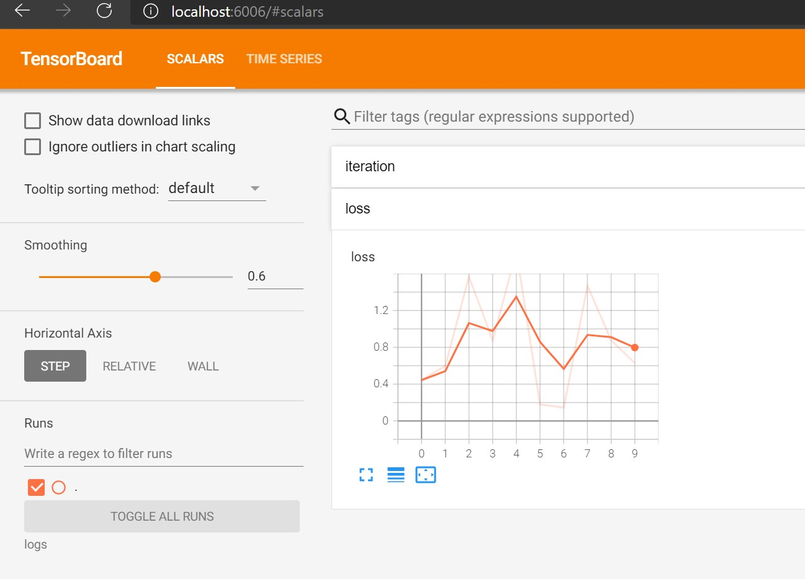

# Stats and tensorboard
We have implemented a wrapper on Tensorboard's SummaryWriter for logging stats to Tensorboard which makes it easy to use the utility to save TB events and visualize on TB later for tracking the progress of your training experiment. We also have the Azure ML writer to be able to write to the AML logs.
```python
import os
os.listdir()
```


    ['.ipynb_checkpoints', 'Untitled.ipynb']


```python
import pymarlin
from pymarlin.utils.stats import global_stats, StatInitArgs
from pymarlin.utils.writer import build_writer, WriterInitArgs
```
`global_stats` is a singleton variable that can be used across entire application to log stats. 

```python
writers = ['tensorboard','stdout','aml']
writerargs = WriterInitArgs(
    tb_log_dir = './logs'
    )
writer_objects = [build_writer(w, writerargs) for w in writers]
global_stats.rebuild(StatInitArgs(), writer_objects)
```

    SystemLog: 2021-01-29 16:02:21,033:INFO : pymarlin.utils.writer.tensorboard : 37 : Cleared directory ./logs (skipping azureml dirs)
    SystemLog: 2021-01-29 16:02:21,040:INFO : pymarlin.utils.writer.tensorboard : 40 : Created tensorboard folder ./logs : []

## Write some stats
```python
for i in range(10):
    global_stats.update('loss',random.uniform(0,2), frequent = True ) # adds a new in memory stat
    global_stats.log_stats(step = i) #actually logs stats to stdout, tensorboard and aml simultaneously
```

    SystemLog: 2021-01-29 16:06:40,276:INFO : pymarlin.utils.writer.stdout : 10 : step = 0, iteration : 0
    SystemLog: 2021-01-29 16:06:40,279:INFO : pymarlin.utils.writer.stdout : 10 : step = 0, loss : 0.44372909088471446
    SystemLog: 2021-01-29 16:06:40,284:INFO : pymarlin.utils.writer.stdout : 10 : step = 1, loss : 0.5985009500820384
    SystemLog: 2021-01-29 16:06:40,285:INFO : pymarlin.utils.writer.stdout : 10 : step = 2, loss : 1.5669796666205043
    SystemLog: 2021-01-29 16:06:40,286:INFO : pymarlin.utils.writer.stdout : 10 : step = 3, loss : 0.8748342474891679
    SystemLog: 2021-01-29 16:06:40,288:INFO : pymarlin.utils.writer.stdout : 10 : step = 4, loss : 1.8371541447672195
    SystemLog: 2021-01-29 16:06:40,290:INFO : pymarlin.utils.writer.stdout : 10 : step = 5, loss : 0.18000397399047174
    SystemLog: 2021-01-29 16:06:40,292:INFO : pymarlin.utils.writer.stdout : 10 : step = 6, loss : 0.1455008149921977
    SystemLog: 2021-01-29 16:06:40,293:INFO : pymarlin.utils.writer.stdout : 10 : step = 7, loss : 1.4704800219353158
    SystemLog: 2021-01-29 16:06:40,297:INFO : pymarlin.utils.writer.stdout : 10 : step = 8, loss : 0.8764679987392285
    SystemLog: 2021-01-29 16:06:40,298:INFO : pymarlin.utils.writer.stdout : 10 : step = 9, loss : 0.6293567937040325

## Check tensorboard logs
```python
os.listdir('logs')
```

    ['events.out.tfevents.1611964941.krishan-surface.16776.1']

```python
!tensorboard --logdir logs
```



For more info on stats, check the stat module docstring in **pymarlin API** section
